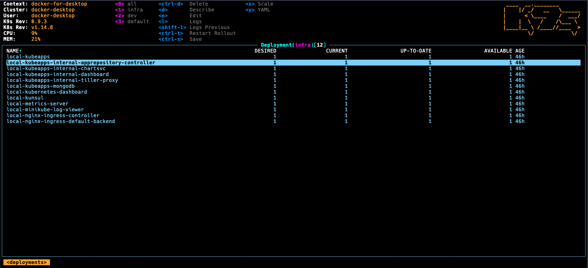

# Use K9s to manage your Kubernetes cluster

## What is it?

A curses style terminal UI that can be used to interact with a Kubernetes cluster. Monitor the cluster, view logs, run commands against K8s resources.

## Where do I get it?

https://github.com/derailed/k9s

## Why should I use it?

- **It makes learning and using Kubernetes less scary**
- It's easier to learn than `kubectl`
- It's faster to use than K8s dashboard
- It's fun and [curses terminal UIs](<https://en.wikipedia.org/wiki/Curses_(programming_library)>) are cool 😎
